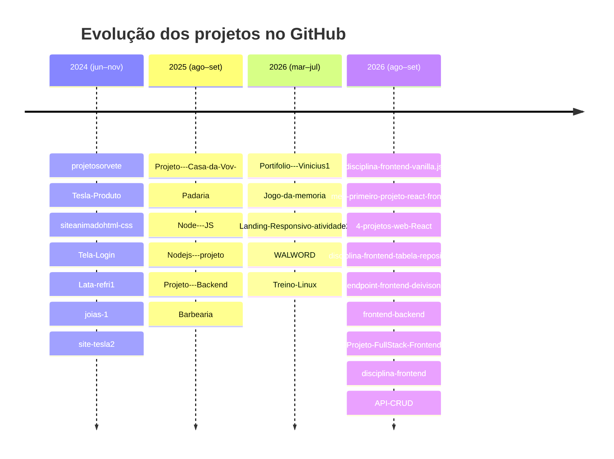

  

  

  

# 👋 Olá, eu sou o Vinícius

Estudante técnico no **SENAI**, com foco em **desenvolvimento web front-end**, **redes de computadores** e **cloud computing**. Este repositório reúne uma visão geral de todos os meus projetos no GitHub — da disciplina de Frameworks Front-end aos projetos práticos de front-end, back-end e full-stack.

---

## 🧭 O que estou estudando

- 🌐 **Frameworks Front-end** (SENAI) — HTML5, CSS3, JavaScript, React, consumo e criação de APIs REST
- 🔌 **Redes de Computadores** — subnetting, arquitetura de rede
- ☁️ **Cloud Computing / Google Cloud Platform (GCP)** — IaaS/PaaS/SaaS, comparação entre AWS, Azure e GCP
- 🤖 **Inteligência Artificial** — LLMs, agentes de IA, Google ADK (Agent Development Kit), RAG
- 🛠️ DevOps/Deploy — Git, GitHub, Render, Vercel

---

## 🛠️ Stack e ferramentas

---

## 📊 GitHub Stats

---

## 📂 Repositórios por categoria

### ⚡ Back-end / APIs REST
| Repositório | Descrição |
|---|---|
| [`API-CRUD`](https://github.com/ViniciuspSouza23/API-CRUD) | API REST de Notas (CRUD) — Node.js + Express + `data.json`, front-end SPA em Dark Mode/Glassmorphism, coleção Postman completa (SENAI Aula 05) |
| [`Projeto-FullStack-Frontend`](https://github.com/ViniciuspSouza23/Projeto-FullStack-Frontend) | **TimeSync** — dashboard full-stack (API Express + React/Vite) para métricas de data/hora e sistema em tempo real, com deploy em Render + Vercel |
| [`frontend-backend`](https://github.com/ViniciuspSouza23/frontend-backend) | **TimePulse** — API REST em Express (`/api/datetime`) com interface Glassmorphism, pronta para deploy no Render |
| [`endpoint-frontend-deivison`](https://github.com/ViniciuspSouza23/endpoint-frontend-deivison) | Endpoint de API REST retornando data/hora, consumido por front-end (exercício de EndPoint) |
| [`Projeto---Backend`](https://github.com/ViniciuspSouza23/Projeto---Backend) | Projeto de prática de back-end em JavaScript/Node |
| [`Nodejs---projeto`](https://github.com/ViniciuspSouza23/Nodejs---projeto) · [`Node---JS`](https://github.com/ViniciuspSouza23/Node---JS) | Projetos de treino com Node.js |

### 🎓 Disciplina Frameworks Front-end (SENAI)
| Repositório | Descrição |
|---|---|
| [`disciplina-frontend`](https://github.com/ViniciuspSouza23/disciplina-frontend) | Repositório atual com os resumos de todas as aulas (Aula 01 a 05+), atividades e projetos práticos |
| [`disciplina-frontend-vanilla.js`](https://github.com/ViniciuspSouza23/disciplina-frontend-vanilla.js) | Versão anterior do repositório da disciplina |
| [`disciplina-frontend-tabela-reposit-rios.`](https://github.com/ViniciuspSouza23/disciplina-frontend-tabela-reposit-rios.) | Tabela de repositórios (Atividade sobre projetos GitHub que consomem APIs) |
| [`meu-primeiro-projeto-react-frontend`](https://github.com/ViniciuspSouza23/meu-primeiro-projeto-react-frontend) | Atividade da Aula 02 — configuração de ambiente, Git/GitHub, SemVer, primeiro projeto React |
| [`Treino-Linux`](https://github.com/ViniciuspSouza23/Treino-Linux) | Treinamento de comandos e conceitos de Linux |

### ⚛️ React
| Repositório | Descrição |
|---|---|
| [`4-projetos-web-React`](https://github.com/ViniciuspSouza23/4-projetos-web-React) | Conjunto de 4 projetos web construídos com Create React App |

### 🎨 Front-end / Landing pages / Sites práticos
| Repositório | Descrição |
|---|---|
| [`Tesla-Produto`](https://github.com/ViniciuspSouza23/Tesla-Produto) · [`site-tesla2`](https://github.com/ViniciuspSouza23/site-tesla2) · [`Aula-CSS-e-HTML---Projeto-Tesla`](https://github.com/ViniciuspSouza23/Aula-CSS-e-HTML---Projeto-Tesla) | Páginas de produto estilo Tesla — prática de HTML/CSS |
| [`Padaria---P-o-Arte-Vinicius`](https://github.com/ViniciuspSouza23/Padaria---P-o-Arte-Vinicius) | Site de padaria |
| [`Projeto---Casa-da-Vov-`](https://github.com/ViniciuspSouza23/Projeto---Casa-da-Vov-) | Site "Casa da Vovó" |
| [`Barbearia`](https://github.com/ViniciuspSouza23/Barbearia) · [`Barbearia---Responsivo`](https://github.com/ViniciuspSouza23/Barbearia---Responsivo) | Site de barbearia (com versão responsiva) |
| [`joias-1`](https://github.com/ViniciuspSouza23/joias-1) | Site de loja de joias |
| [`projetosorvete`](https://github.com/ViniciuspSouza23/projetosorvete) | Site de sorveteria |
| [`Lata-refri1`](https://github.com/ViniciuspSouza23/Lata-refri1) | Projeto de landing page (refrigerante) |
| [`siteanimadohtml-css`](https://github.com/ViniciuspSouza23/siteanimadohtml-css) | Site com animações em HTML/CSS |
| [`Tela-Login`](https://github.com/ViniciuspSouza23/Tela-Login) | Tela de login estilizada |
| [`Jogo-da-memoria---Clash-royale`](https://github.com/ViniciuspSouza23/Jogo-da-memoria---Clash-royale) | Jogo da memória temático (Clash Royale) |
| [`Landing-Responsivo-atividade2`](https://github.com/ViniciuspSouza23/Landing-Responsivo-atividade2) | Landing page responsiva |

### 💼 Portfólio
| Repositório | Descrição |
|---|---|
| [`Portifolio---Vinicius1`](https://github.com/ViniciuspSouza23/Portifolio---Vinicius1) | Site de portfólio pessoal |

### 🛍️ Projeto integrador
| Repositório | Descrição |
|---|---|
| [`Projeto-de-Extens-o---WALWORD`](https://github.com/ViniciuspSouza23/Projeto-de-Extens-o---WALWORD) | **WalkWord Smart Store** — e-commerce de calçados (projeto integrador SENAI), com Google OAuth, Apple Sign In e API ViaCEP |

---

## 📈 Linha do tempo (pelos commits mais recentes)

---

## 🐍 Contribuições

  

---

🎓 *Overview gerado a partir da análise dos repositórios públicos de [ViniciuspSouza23](https://github.com/ViniciuspSouza23) no GitHub.*
